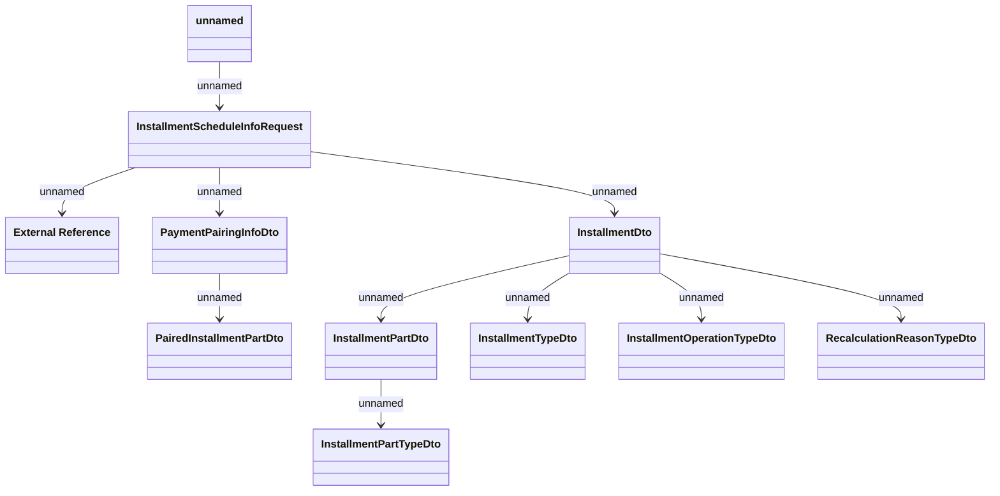

# Generated messages - Installment Schedule Info Request

```mermaid
classDiagram
    class PairedInstallmentPartDto["PairedInstallmentPartDto"]
    class External_Reference["External Reference"]
    class PaymentPairingInfoDto["PaymentPairingInfoDto"]
    class InstallmentPartTypeDto["InstallmentPartTypeDto"]
    class InstallmentScheduleInfoRequest["InstallmentScheduleInfoRequest"]
    class InstallmentDto["InstallmentDto"]
    class InstallmentPartDto["InstallmentPartDto"]
    class InstallmentTypeDto["InstallmentTypeDto"]
    class InstallmentOperationTypeDto["InstallmentOperationTypeDto"]
    class RecalculationReasonTypeDto["RecalculationReasonTypeDto"]
    unnamed --> InstallmentScheduleInfoRequest : unnamed
    PaymentPairingInfoDto --> PairedInstallmentPartDto : unnamed
    InstallmentScheduleInfoRequest --> PaymentPairingInfoDto : unnamed
    InstallmentScheduleInfoRequest --> InstallmentDto : unnamed
    InstallmentScheduleInfoRequest --> External_Reference : unnamed
    InstallmentDto --> InstallmentOperationTypeDto : unnamed
    InstallmentDto --> InstallmentPartDto : unnamed
    InstallmentPartDto --> InstallmentPartTypeDto : unnamed
    InstallmentDto --> InstallmentTypeDto : unnamed
    InstallmentDto --> RecalculationReasonTypeDto : unnamed
```
