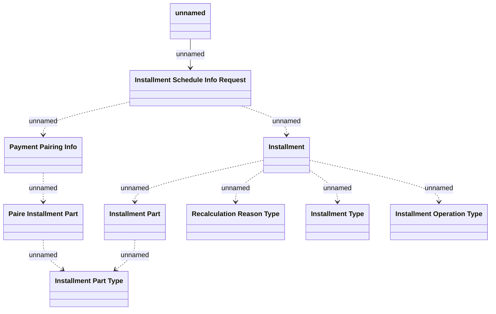

# Installment Schedule Info Request v2

- **Diagram Type**: Logical
- **Package**: HomerSelect/BSL/Analysis Model/_Interface/RabbitMQ messages/Generated RabbitMQ messages/Installment Schedule/Installment Schedule Info Request/v2
- **Diagram ID**: 159652
- **Elements**: 10
- **Connectors**: 10

