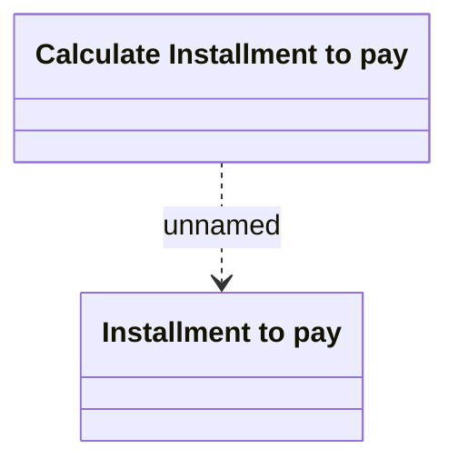

# Installment to Pay v1

- **Diagram Type**: Logical
- **Package**: HomerSelect/BSL/Analysis Model/_Interface/RabbitMQ messages/Generated RabbitMQ messages/Installment Schedule/Installment to pay/v1
- **Diagram ID**: 157540
- **Elements**: 2
- **Connectors**: 1

