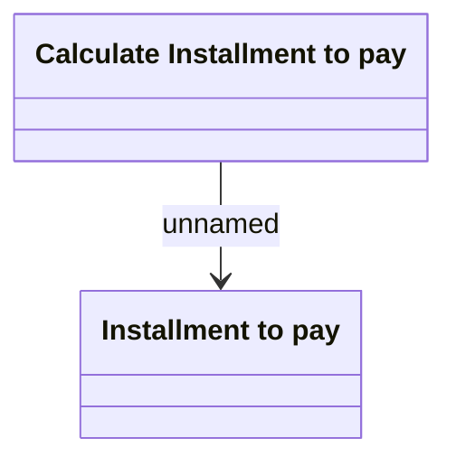

# Installment to Pay v1

```mermaid
classDiagram
    class Calculate_Installment_to_pay["Calculate Installment to pay"]
    class Installment_to_pay["Installment to pay"]
    Calculate_Installment_to_pay --> Installment_to_pay : unnamed
```
