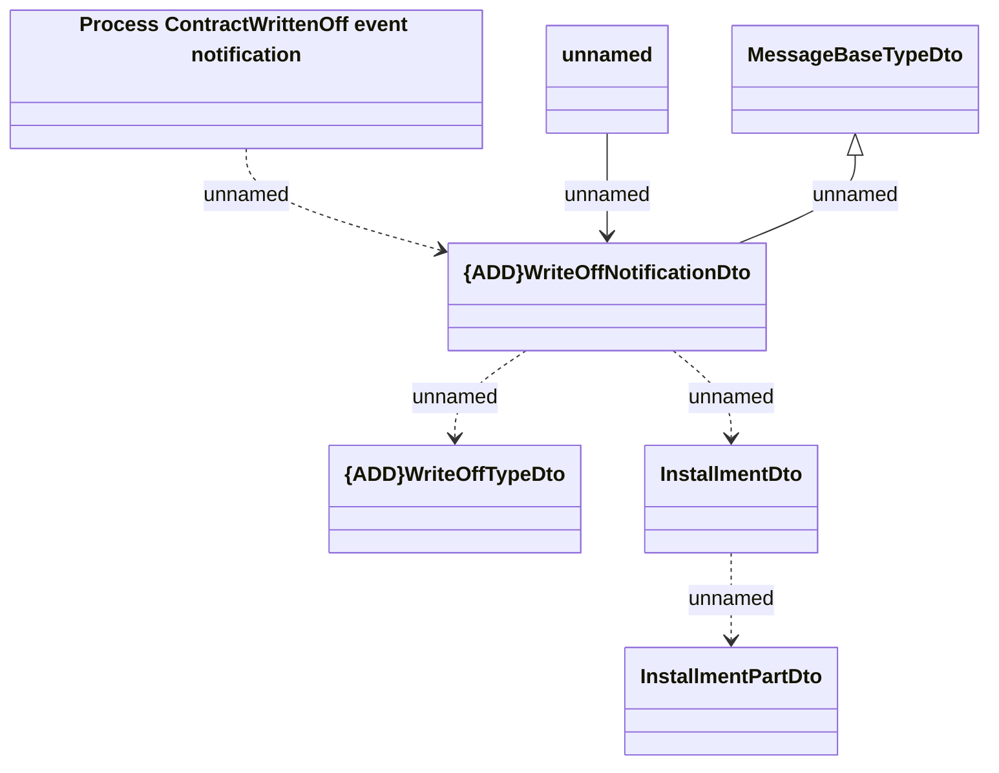

# Generated messages - WriteOffNotification

- **Diagram Type**: Logical
- **Package**: HomerSelect/BSL/Analysis Model/_Interface/RabbitMQ messages/Generated RabbitMQ messages/Installment Schedule/Write Off Notification
- **Diagram ID**: 152192
- **Elements**: 7
- **Connectors**: 6

