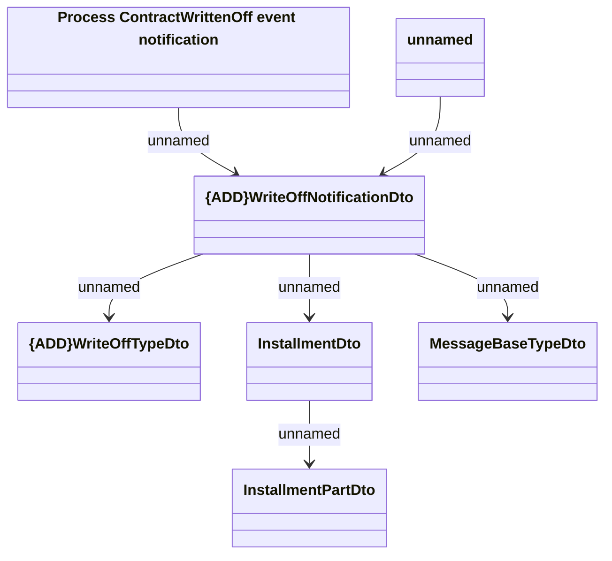

# Generated messages - WriteOffNotification

```mermaid
classDiagram
    class Process_ContractWrittenOff_event_notification["Process ContractWrittenOff event notification"]
    class ADD_WriteOffTypeDto["{ADD}WriteOffTypeDto"]
    class InstallmentDto["InstallmentDto"]
    class InstallmentPartDto["InstallmentPartDto"]
    class ADD_WriteOffNotificationDto["{ADD}WriteOffNotificationDto"]
    class MessageBaseTypeDto["MessageBaseTypeDto"]
    Process_ContractWrittenOff_event_notification --> ADD_WriteOffNotificationDto : unnamed
    unnamed --> ADD_WriteOffNotificationDto : unnamed
    InstallmentDto --> InstallmentPartDto : unnamed
    ADD_WriteOffNotificationDto --> MessageBaseTypeDto : unnamed
    ADD_WriteOffNotificationDto --> ADD_WriteOffTypeDto : unnamed
    ADD_WriteOffNotificationDto --> InstallmentDto : unnamed
```
