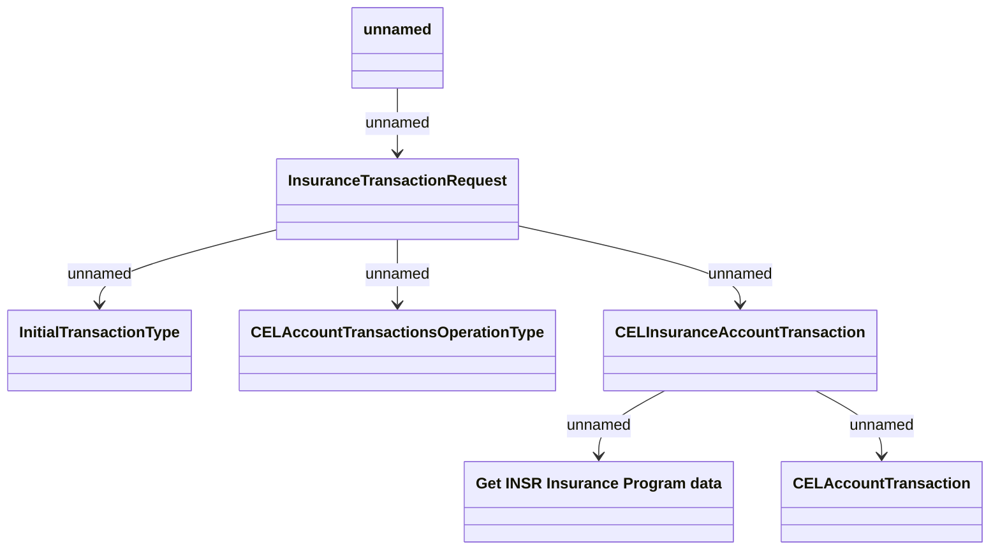

# Generated JMS messages - Additional insurance transaction v4

```mermaid
classDiagram
    class InitialTransactionType["InitialTransactionType"]
    class CELAccountTransactionsOperationType["CELAccountTransactionsOperationType"]
    class CELInsuranceAccountTransaction["CELInsuranceAccountTransaction"]
    class CELAccountTransaction["CELAccountTransaction"]
    class Get_INSR_Insurance_Program_data["Get INSR Insurance Program data"]
    class InsuranceTransactionRequest["InsuranceTransactionRequest"]
    unnamed --> InsuranceTransactionRequest : unnamed
    CELInsuranceAccountTransaction --> Get_INSR_Insurance_Program_data : unnamed
    CELInsuranceAccountTransaction --> CELAccountTransaction : unnamed
    InsuranceTransactionRequest --> CELInsuranceAccountTransaction : unnamed
    InsuranceTransactionRequest --> CELAccountTransactionsOperationType : unnamed
    InsuranceTransactionRequest --> InitialTransactionType : unnamed
```
