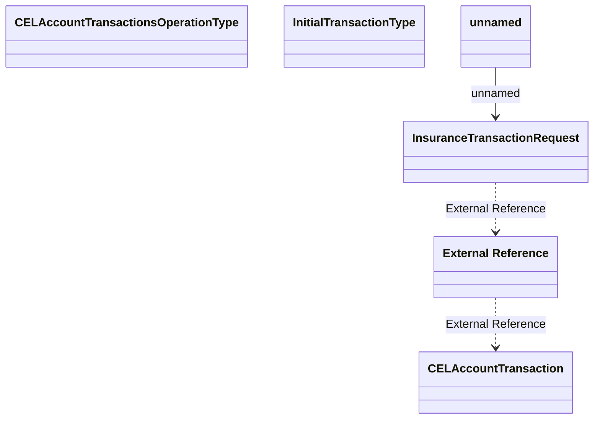

# Generated JMS messages - Additional insurance transaction

- **Diagram Type**: Logical
- **Package**: HomerSelect/BSL/Analysis Model/_Interface/RabbitMQ messages/Generated RabbitMQ messages/Insurance Transaction (CITR)
- **Diagram ID**: 164338
- **Elements**: 6
- **Connectors**: 3

