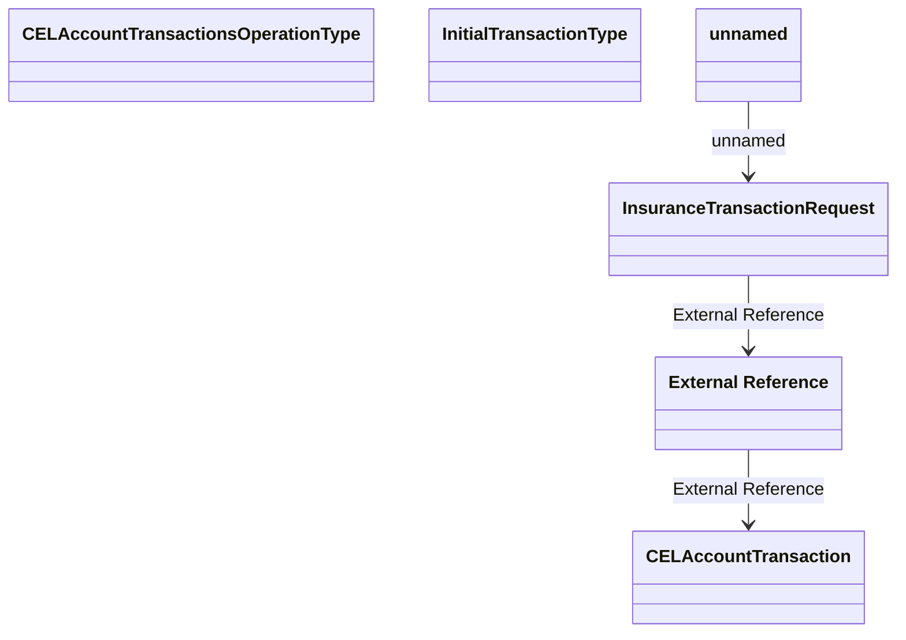

# Generated JMS messages - Additional insurance transaction

```mermaid
classDiagram
    class CELAccountTransactionsOperationType["CELAccountTransactionsOperationType"]
    class InitialTransactionType["InitialTransactionType"]
    class CELAccountTransaction["CELAccountTransaction"]
    class External_Reference["External Reference"]
    class InsuranceTransactionRequest["InsuranceTransactionRequest"]
    unnamed --> InsuranceTransactionRequest : unnamed
    InsuranceTransactionRequest --> External_Reference : External Reference
    External_Reference --> CELAccountTransaction : External Reference
```
