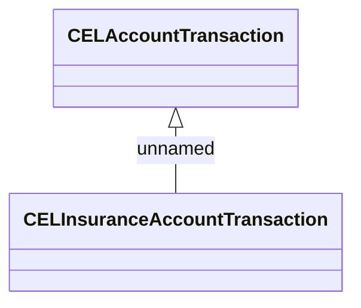

# Types

- **Diagram Type**: Logical
- **Package**: HomerSelect/BSL/Analysis Model/_Interface/RabbitMQ messages/Generated RabbitMQ messages/Insurance Transaction (CITR)/Types
- **Diagram ID**: 144736
- **Elements**: 2
- **Connectors**: 1

