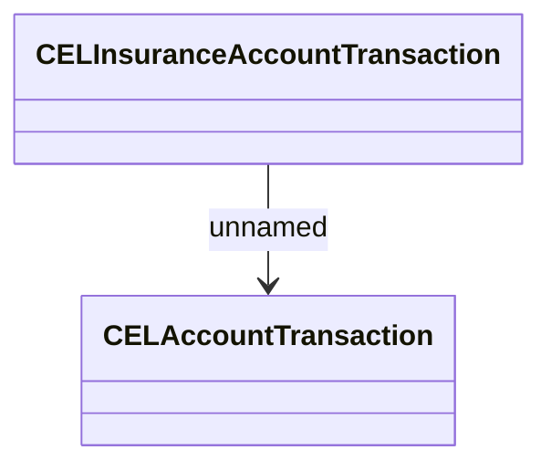

# Types

```mermaid
classDiagram
    class CELAccountTransaction["CELAccountTransaction"]
    class CELInsuranceAccountTransaction["CELInsuranceAccountTransaction"]
    CELInsuranceAccountTransaction --> CELAccountTransaction : unnamed
```
