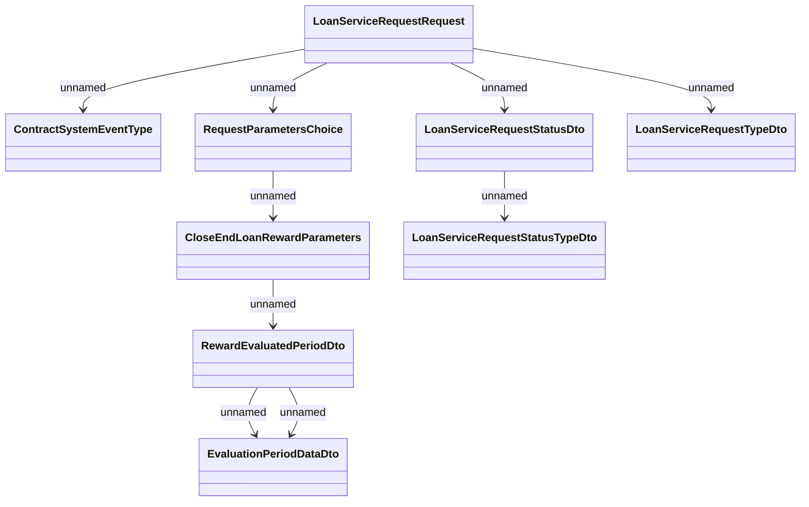

# Loan Service Request notifications - CEL Rewards

```mermaid
classDiagram
    class ContractSystemEventType["ContractSystemEventType"]
    class EvaluationPeriodDataDto["EvaluationPeriodDataDto"]
    class RewardEvaluatedPeriodDto["RewardEvaluatedPeriodDto"]
    class CloseEndLoanRewardParameters["CloseEndLoanRewardParameters"]
    class RequestParametersChoice["RequestParametersChoice"]
    class LoanServiceRequestStatusDto["LoanServiceRequestStatusDto"]
    class LoanServiceRequestStatusTypeDto["LoanServiceRequestStatusTypeDto"]
    class LoanServiceRequestTypeDto["LoanServiceRequestTypeDto"]
    class LoanServiceRequestRequest["LoanServiceRequestRequest"]
    LoanServiceRequestRequest --> LoanServiceRequestTypeDto : unnamed
    LoanServiceRequestStatusDto --> LoanServiceRequestStatusTypeDto : unnamed
    LoanServiceRequestRequest --> LoanServiceRequestStatusDto : unnamed
    LoanServiceRequestRequest --> RequestParametersChoice : unnamed
    RequestParametersChoice --> CloseEndLoanRewardParameters : unnamed
    CloseEndLoanRewardParameters --> RewardEvaluatedPeriodDto : unnamed
    RewardEvaluatedPeriodDto --> EvaluationPeriodDataDto : unnamed
    RewardEvaluatedPeriodDto --> EvaluationPeriodDataDto : unnamed
    LoanServiceRequestRequest --> ContractSystemEventType : unnamed
```
