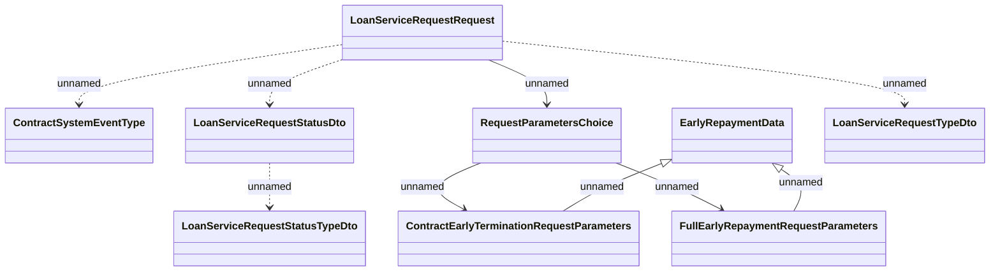

# Loan Service Request notifications - CET&FER request

- **Diagram Type**: Logical
- **Package**: HomerSelect/BSL/Analysis Model/_Interface/RabbitMQ messages/Generated RabbitMQ messages/Loan Service Request notifications
- **Diagram ID**: 162001
- **Elements**: 9
- **Connectors**: 9

