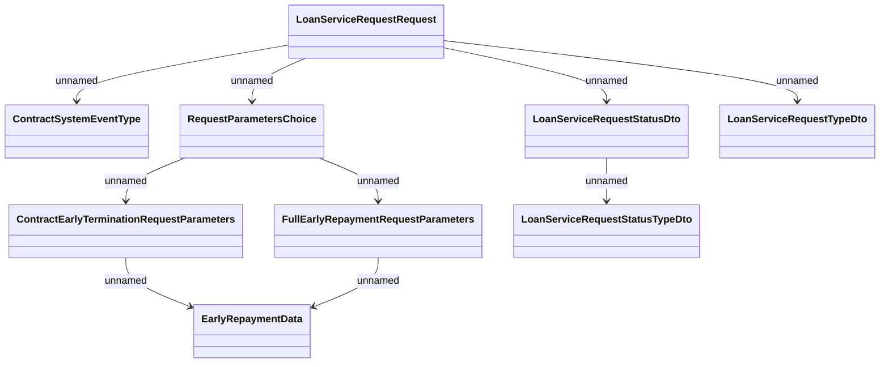

# Loan Service Request notifications - CET&FER request

```mermaid
classDiagram
    class ContractSystemEventType["ContractSystemEventType"]
    class EarlyRepaymentData["EarlyRepaymentData"]
    class FullEarlyRepaymentRequestParameters["FullEarlyRepaymentRequestParameters"]
    class ContractEarlyTerminationRequestParameters["ContractEarlyTerminationRequestParameters"]
    class RequestParametersChoice["RequestParametersChoice"]
    class LoanServiceRequestStatusDto["LoanServiceRequestStatusDto"]
    class LoanServiceRequestStatusTypeDto["LoanServiceRequestStatusTypeDto"]
    class LoanServiceRequestTypeDto["LoanServiceRequestTypeDto"]
    class LoanServiceRequestRequest["LoanServiceRequestRequest"]
    LoanServiceRequestRequest --> LoanServiceRequestTypeDto : unnamed
    LoanServiceRequestStatusDto --> LoanServiceRequestStatusTypeDto : unnamed
    LoanServiceRequestRequest --> LoanServiceRequestStatusDto : unnamed
    LoanServiceRequestRequest --> RequestParametersChoice : unnamed
    RequestParametersChoice --> ContractEarlyTerminationRequestParameters : unnamed
    RequestParametersChoice --> FullEarlyRepaymentRequestParameters : unnamed
    ContractEarlyTerminationRequestParameters --> EarlyRepaymentData : unnamed
    FullEarlyRepaymentRequestParameters --> EarlyRepaymentData : unnamed
    LoanServiceRequestRequest --> ContractSystemEventType : unnamed
```
