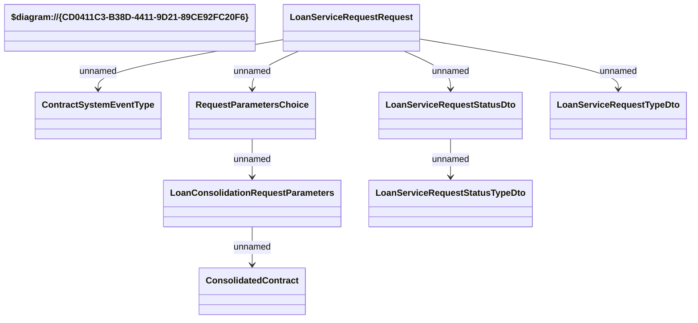

# Loan Service Request notifications - Consolidation

```mermaid
classDiagram
    class ContractSystemEventType["ContractSystemEventType"]
    class diagram_CD0411C3_B38D_4411_9D21_89CE92FC20F6["$diagram://{CD0411C3-B38D-4411-9D21-89CE92FC20F6}"]
    class ConsolidatedContract["ConsolidatedContract"]
    class LoanConsolidationRequestParameters["LoanConsolidationRequestParameters"]
    class RequestParametersChoice["RequestParametersChoice"]
    class LoanServiceRequestStatusDto["LoanServiceRequestStatusDto"]
    class LoanServiceRequestStatusTypeDto["LoanServiceRequestStatusTypeDto"]
    class LoanServiceRequestTypeDto["LoanServiceRequestTypeDto"]
    class LoanServiceRequestRequest["LoanServiceRequestRequest"]
    LoanServiceRequestRequest --> LoanServiceRequestTypeDto : unnamed
    LoanServiceRequestStatusDto --> LoanServiceRequestStatusTypeDto : unnamed
    LoanServiceRequestRequest --> LoanServiceRequestStatusDto : unnamed
    LoanServiceRequestRequest --> RequestParametersChoice : unnamed
    RequestParametersChoice --> LoanConsolidationRequestParameters : unnamed
    LoanConsolidationRequestParameters --> ConsolidatedContract : unnamed
    LoanServiceRequestRequest --> ContractSystemEventType : unnamed
```
