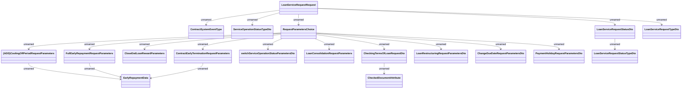

# Loan Service Request notifications

```mermaid
classDiagram
    class ContractSystemEventType["ContractSystemEventType"]
    class EarlyRepaymentData["EarlyRepaymentData"]
    class ADD_CoolingOffPeriodRequestParameters["{ADD}CoolingOffPeriodRequestParameters"]
    class ContractEarlyTerminationRequestParameters["ContractEarlyTerminationRequestParameters"]
    class CloseEndLoanRewardParameters["CloseEndLoanRewardParameters"]
    class FullEarlyRepaymentRequestParameters["FullEarlyRepaymentRequestParameters"]
    class switchServiceOperationStatusParametersDto["switchServiceOperationStatusParametersDto"]
    class ServiceOperationStatusTypeDto["ServiceOperationStatusTypeDto"]
    class LoanConsolidationRequestParameters["LoanConsolidationRequestParameters"]
    class CheckedDocumentAttribute["CheckedDocumentAttribute"]
    class CheckingTermsOfLoanRequestDto["CheckingTermsOfLoanRequestDto"]
    class LoanRestructuringRequestParametersDto["LoanRestructuringRequestParametersDto"]
    class ChangeDueDateRequestParametersDto["ChangeDueDateRequestParametersDto"]
    class PaymentHolidayRequestParametersDto["PaymentHolidayRequestParametersDto"]
    class RequestParametersChoice["RequestParametersChoice"]
    class LoanServiceRequestStatusDto["LoanServiceRequestStatusDto"]
    class LoanServiceRequestStatusTypeDto["LoanServiceRequestStatusTypeDto"]
    class LoanServiceRequestTypeDto["LoanServiceRequestTypeDto"]
    class LoanServiceRequestRequest["LoanServiceRequestRequest"]
    RequestParametersChoice --> LoanConsolidationRequestParameters : unnamed
    ADD_CoolingOffPeriodRequestParameters --> EarlyRepaymentData : unnamed
    FullEarlyRepaymentRequestParameters --> EarlyRepaymentData : unnamed
    ContractEarlyTerminationRequestParameters --> EarlyRepaymentData : unnamed
    RequestParametersChoice --> ADD_CoolingOffPeriodRequestParameters : unnamed
    RequestParametersChoice --> ContractEarlyTerminationRequestParameters : unnamed
    RequestParametersChoice --> CloseEndLoanRewardParameters : unnamed
    RequestParametersChoice --> FullEarlyRepaymentRequestParameters : unnamed
    LoanServiceRequestRequest --> ContractSystemEventType : unnamed
    LoanServiceRequestRequest --> ServiceOperationStatusTypeDto : unnamed
    LoanServiceRequestRequest --> LoanServiceRequestTypeDto : unnamed
    CheckingTermsOfLoanRequestDto --> CheckedDocumentAttribute : unnamed
    RequestParametersChoice --> CheckingTermsOfLoanRequestDto : unnamed
    RequestParametersChoice --> LoanRestructuringRequestParametersDto : unnamed
    RequestParametersChoice --> ChangeDueDateRequestParametersDto : unnamed
    RequestParametersChoice --> PaymentHolidayRequestParametersDto : unnamed
    LoanServiceRequestRequest --> RequestParametersChoice : unnamed
    LoanServiceRequestRequest --> LoanServiceRequestStatusDto : unnamed
    LoanServiceRequestStatusDto --> LoanServiceRequestStatusTypeDto : unnamed
    RequestParametersChoice --> switchServiceOperationStatusParametersDto : unnamed
```
