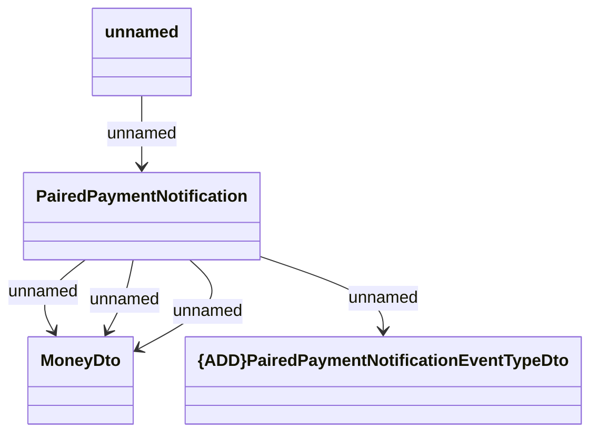

# Paired Payment Notification

```mermaid
classDiagram
    class ADD_PairedPaymentNotificationEventTypeDto["{ADD}PairedPaymentNotificationEventTypeDto"]
    class PairedPaymentNotification["PairedPaymentNotification"]
    class MoneyDto["MoneyDto"]
    PairedPaymentNotification --> MoneyDto : unnamed
    PairedPaymentNotification --> MoneyDto : unnamed
    PairedPaymentNotification --> MoneyDto : unnamed
    unnamed --> PairedPaymentNotification : unnamed
    PairedPaymentNotification --> ADD_PairedPaymentNotificationEventTypeDto : unnamed
```
