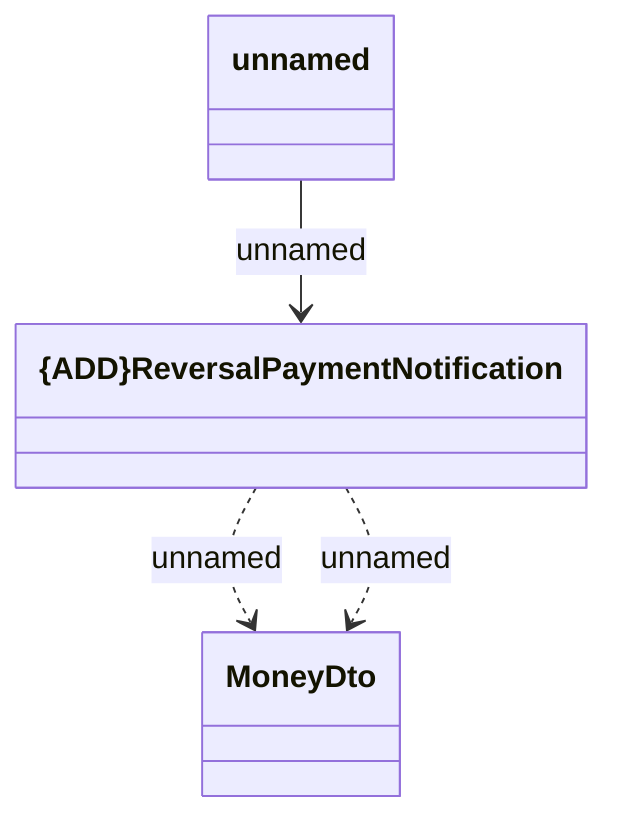

# Reversal Payment Notification

- **Diagram Type**: Logical
- **Package**: HomerSelect/BSL/Analysis Model/_Interface/RabbitMQ messages/Generated RabbitMQ messages/Pairing Notification/Notifications
- **Diagram ID**: 163443
- **Elements**: 3
- **Connectors**: 3

