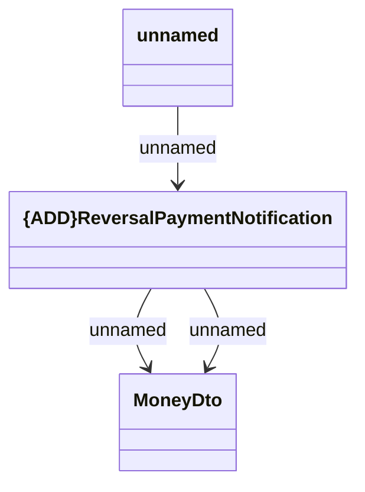

# Reversal Payment Notification

```mermaid
classDiagram
    class MoneyDto["MoneyDto"]
    class ADD_ReversalPaymentNotification["{ADD}ReversalPaymentNotification"]
    unnamed --> ADD_ReversalPaymentNotification : unnamed
    ADD_ReversalPaymentNotification --> MoneyDto : unnamed
    ADD_ReversalPaymentNotification --> MoneyDto : unnamed
```
