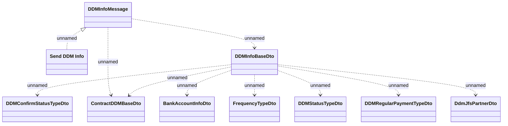

# DDM Info

- **Diagram Type**: Logical
- **Package**: HomerSelect/BSL/Analysis Model/_Interface/RabbitMQ messages/Generated RabbitMQ messages/Payments/DDM
- **Diagram ID**: 163221
- **Elements**: 10
- **Connectors**: 10

