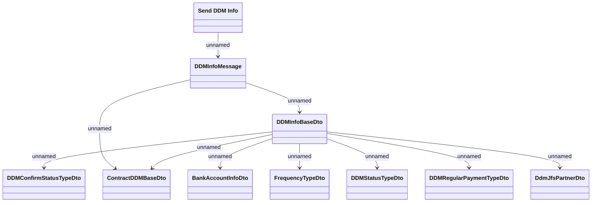

# DDM Info

```mermaid
classDiagram
    class Send_DDM_Info["Send DDM Info"]
    class DdmJfsPartnerDto["DdmJfsPartnerDto"]
    class DDMRegularPaymentTypeDto["DDMRegularPaymentTypeDto"]
    class DDMStatusTypeDto["DDMStatusTypeDto"]
    class FrequencyTypeDto["FrequencyTypeDto"]
    class BankAccountInfoDto["BankAccountInfoDto"]
    class DDMInfoMessage["DDMInfoMessage"]
    class ContractDDMBaseDto["ContractDDMBaseDto"]
    class DDMConfirmStatusTypeDto["DDMConfirmStatusTypeDto"]
    class DDMInfoBaseDto["DDMInfoBaseDto"]
    DDMInfoMessage --> DDMInfoBaseDto : unnamed
    DDMInfoBaseDto --> DDMConfirmStatusTypeDto : unnamed
    DDMInfoMessage --> ContractDDMBaseDto : unnamed
    DDMInfoBaseDto --> ContractDDMBaseDto : unnamed
    Send_DDM_Info --> DDMInfoMessage : unnamed
    DDMInfoBaseDto --> BankAccountInfoDto : unnamed
    DDMInfoBaseDto --> FrequencyTypeDto : unnamed
    DDMInfoBaseDto --> DDMStatusTypeDto : unnamed
    DDMInfoBaseDto --> DDMRegularPaymentTypeDto : unnamed
    DDMInfoBaseDto --> DdmJfsPartnerDto : unnamed
```
