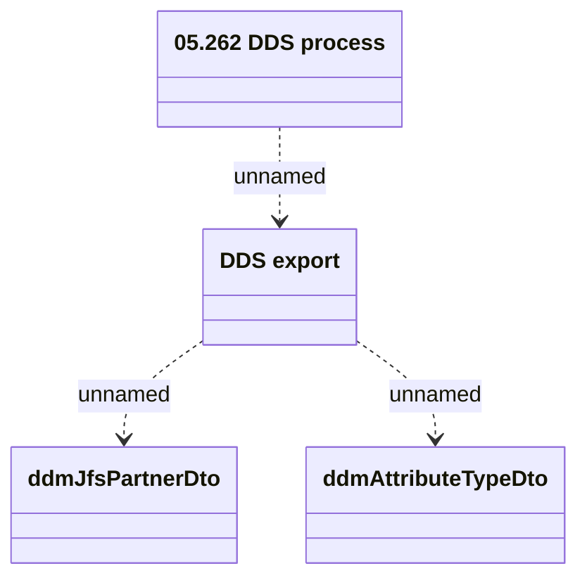

# DDS export

- **Diagram Type**: Logical
- **Package**: HomerSelect/BSL/Analysis Model/_Interface/RabbitMQ messages/Generated RabbitMQ messages/Payments/DDS
- **Diagram ID**: 162812
- **Elements**: 4
- **Connectors**: 3

