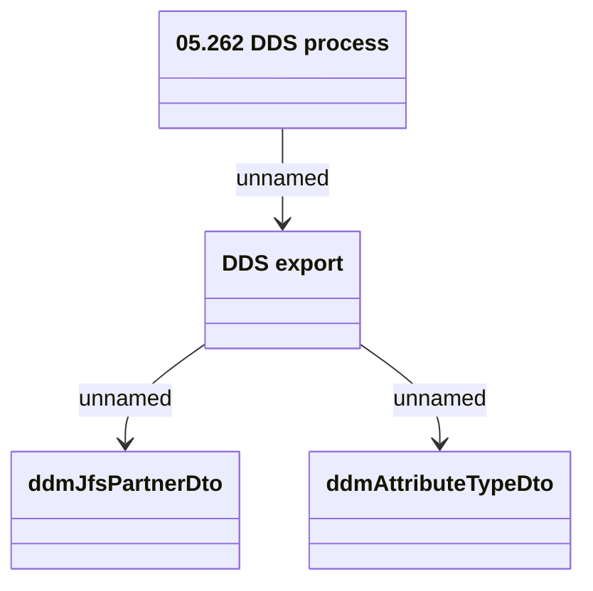

# DDS export

```mermaid
classDiagram
    class ddmAttributeTypeDto["ddmAttributeTypeDto"]
    class ddmJfsPartnerDto["ddmJfsPartnerDto"]
    class n_05_262_DDS_process["05.262 DDS process"]
    class DDS_export["DDS export"]
    n_05_262_DDS_process --> DDS_export : unnamed
    DDS_export --> ddmJfsPartnerDto : unnamed
    DDS_export --> ddmAttributeTypeDto : unnamed
```
