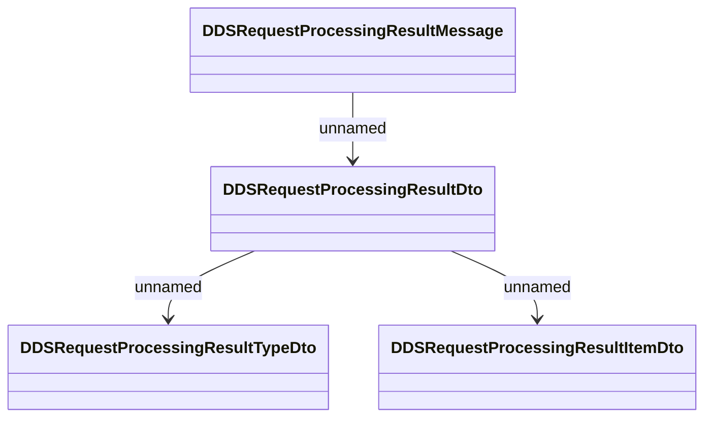

#  DDS request processing result

```mermaid
classDiagram
    class DDSRequestProcessingResultMessage["DDSRequestProcessingResultMessage"]
    class DDSRequestProcessingResultItemDto["DDSRequestProcessingResultItemDto"]
    class DDSRequestProcessingResultTypeDto["DDSRequestProcessingResultTypeDto"]
    class DDSRequestProcessingResultDto["DDSRequestProcessingResultDto"]
    DDSRequestProcessingResultDto --> DDSRequestProcessingResultTypeDto : unnamed
    DDSRequestProcessingResultDto --> DDSRequestProcessingResultItemDto : unnamed
    DDSRequestProcessingResultMessage --> DDSRequestProcessingResultDto : unnamed
```
