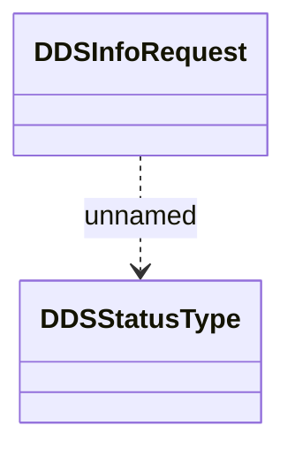

# DDS result notification

- **Diagram Type**: Logical
- **Package**: HomerSelect/BSL/Analysis Model/_Interface/RabbitMQ messages/Generated RabbitMQ messages/Payments/DDS
- **Diagram ID**: 162811
- **Elements**: 2
- **Connectors**: 1

