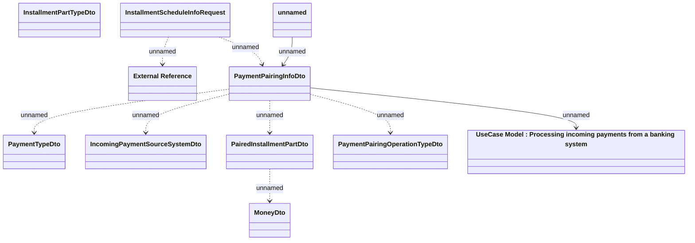

# Generated JMS messages - Incoming payments pairing

- **Diagram Type**: Logical
- **Package**: HomerSelect/BSL/Analysis Model/_Interface/RabbitMQ messages/Generated RabbitMQ messages/Payments/Incoming Payments
- **Diagram ID**: 97710
- **Elements**: 11
- **Connectors**: 9

