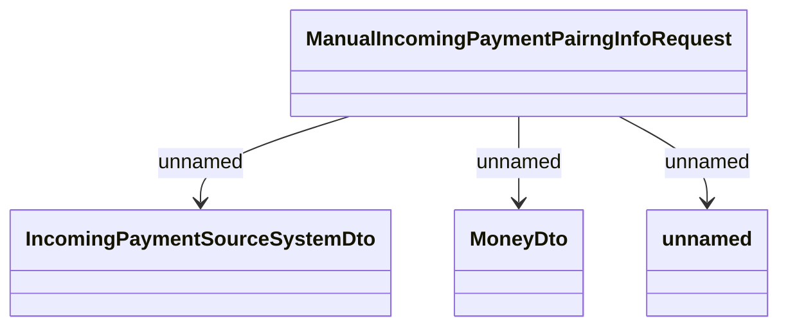

# Generated JMS messages - Manual payment pairing

```mermaid
classDiagram
    class MoneyDto["MoneyDto"]
    class IncomingPaymentSourceSystemDto["IncomingPaymentSourceSystemDto"]
    class ManualIncomingPaymentPairngInfoRequest["ManualIncomingPaymentPairngInfoRequest"]
    ManualIncomingPaymentPairngInfoRequest --> IncomingPaymentSourceSystemDto : unnamed
    ManualIncomingPaymentPairngInfoRequest --> MoneyDto : unnamed
    ManualIncomingPaymentPairngInfoRequest --> unnamed : unnamed
```
