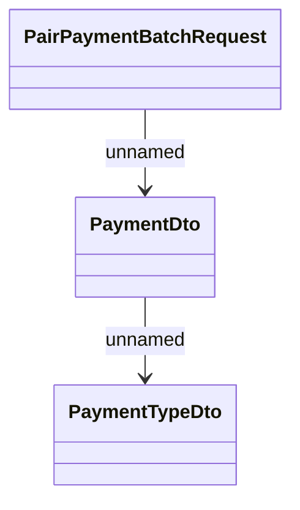

# Generated JMS messages - Pair payment batch

```mermaid
classDiagram
    class PaymentTypeDto["PaymentTypeDto"]
    class PaymentDto["PaymentDto"]
    class PairPaymentBatchRequest["PairPaymentBatchRequest"]
    PaymentDto --> PaymentTypeDto : unnamed
    PairPaymentBatchRequest --> PaymentDto : unnamed
```
