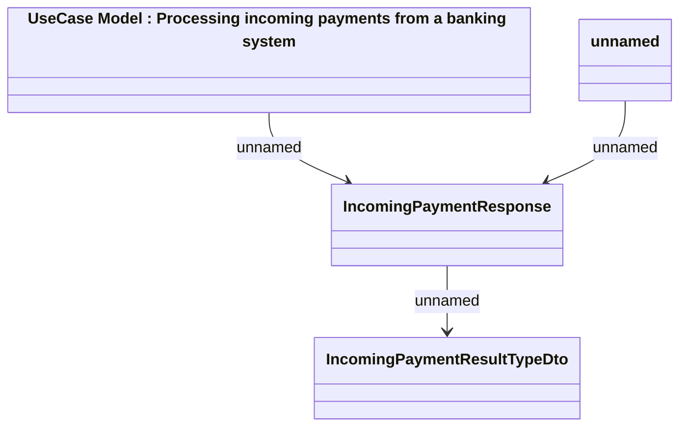

# Generated JMS messages - Set incoming payment (response)

```mermaid
classDiagram
    class UseCase_Model_Processing_incoming_payments_from_a_banking_sy["UseCase Model : Processing incoming payments from a banking system"]
    class IncomingPaymentResponse["IncomingPaymentResponse"]
    class IncomingPaymentResultTypeDto["IncomingPaymentResultTypeDto"]
    UseCase_Model_Processing_incoming_payments_from_a_banking_sy --> IncomingPaymentResponse : unnamed
    unnamed --> IncomingPaymentResponse : unnamed
    IncomingPaymentResponse --> IncomingPaymentResultTypeDto : unnamed
```
