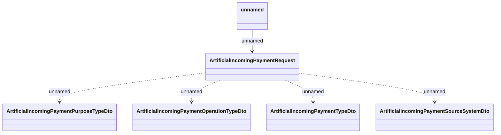

# Generated JSM messages - Request payment

- **Diagram Type**: Logical
- **Package**: HomerSelect/BSL/Analysis Model/_Interface/RabbitMQ messages/Generated RabbitMQ messages/Payments/Incoming Payments
- **Diagram ID**: 97711
- **Elements**: 6
- **Connectors**: 5

