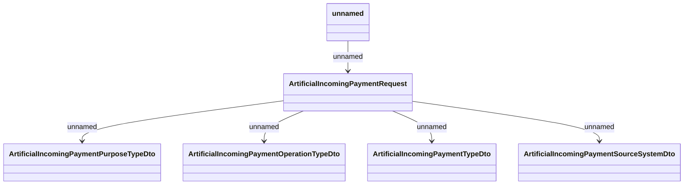

# Generated JSM messages - Request payment

```mermaid
classDiagram
    class ArtificialIncomingPaymentSourceSystemDto["ArtificialIncomingPaymentSourceSystemDto"]
    class ArtificialIncomingPaymentOperationTypeDto["ArtificialIncomingPaymentOperationTypeDto"]
    class ArtificialIncomingPaymentPurposeTypeDto["ArtificialIncomingPaymentPurposeTypeDto"]
    class ArtificialIncomingPaymentTypeDto["ArtificialIncomingPaymentTypeDto"]
    class ArtificialIncomingPaymentRequest["ArtificialIncomingPaymentRequest"]
    unnamed --> ArtificialIncomingPaymentRequest : unnamed
    ArtificialIncomingPaymentRequest --> ArtificialIncomingPaymentPurposeTypeDto : unnamed
    ArtificialIncomingPaymentRequest --> ArtificialIncomingPaymentOperationTypeDto : unnamed
    ArtificialIncomingPaymentRequest --> ArtificialIncomingPaymentTypeDto : unnamed
    ArtificialIncomingPaymentRequest --> ArtificialIncomingPaymentSourceSystemDto : unnamed
```
