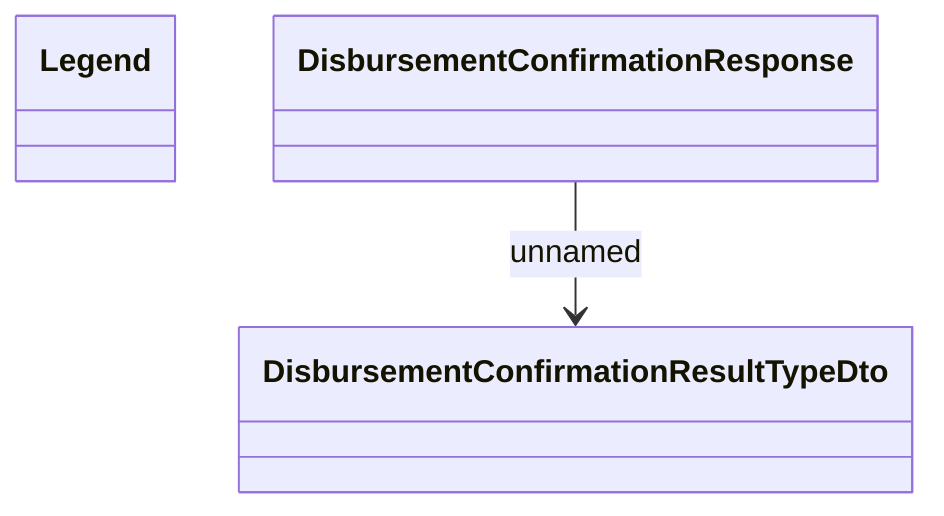

# Disbursement confirmation response

```mermaid
classDiagram
    class Legend["Legend"]
    class DisbursementConfirmationResultTypeDto["DisbursementConfirmationResultTypeDto"]
    class DisbursementConfirmationResponse["DisbursementConfirmationResponse"]
    DisbursementConfirmationResponse --> DisbursementConfirmationResultTypeDto : unnamed
```
