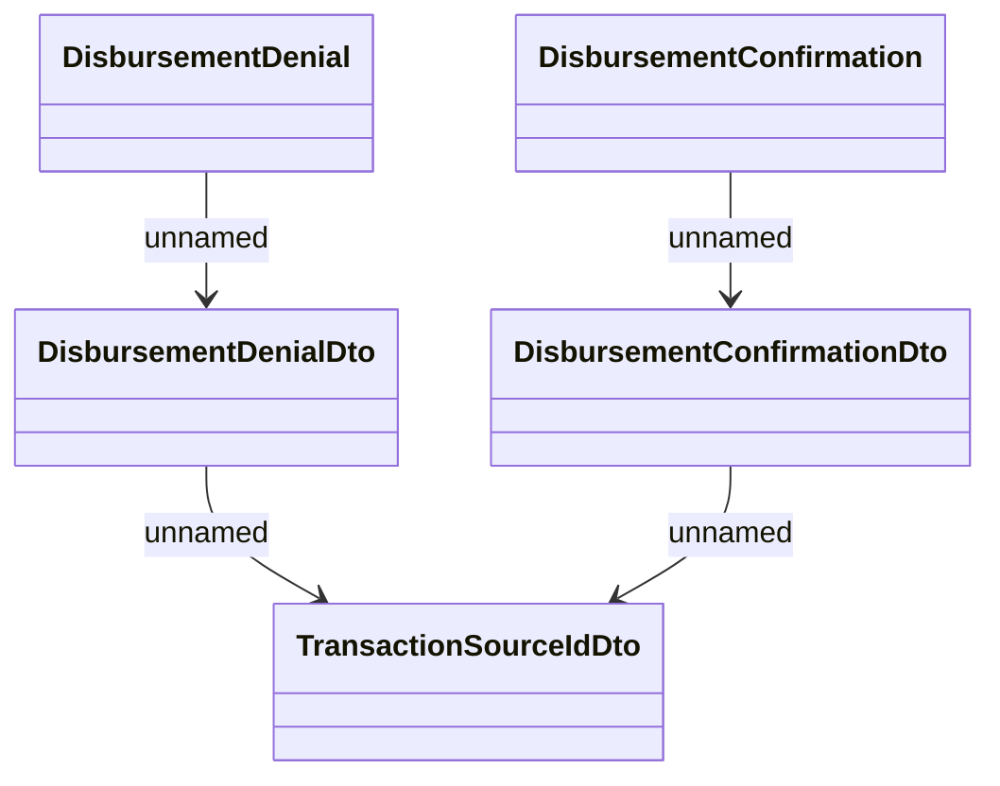

# Disbursement result messages

```mermaid
classDiagram
    class DisbursementDenialDto["DisbursementDenialDto"]
    class DisbursementDenial["DisbursementDenial"]
    class TransactionSourceIdDto["TransactionSourceIdDto"]
    class DisbursementConfirmationDto["DisbursementConfirmationDto"]
    class DisbursementConfirmation["DisbursementConfirmation"]
    DisbursementConfirmation --> DisbursementConfirmationDto : unnamed
    DisbursementDenialDto --> TransactionSourceIdDto : unnamed
    DisbursementConfirmationDto --> TransactionSourceIdDto : unnamed
    DisbursementDenial --> DisbursementDenialDto : unnamed
```
