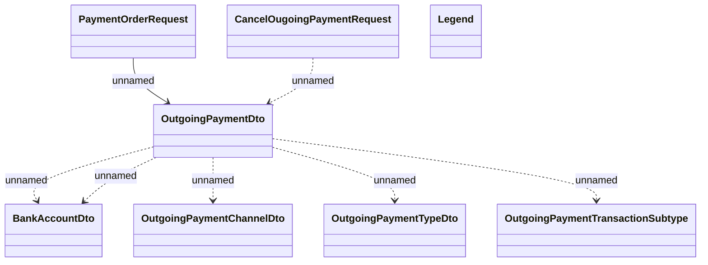

# Outgoing payments request

- **Diagram Type**: Logical
- **Package**: HomerSelect/BSL/Analysis Model/_Interface/RabbitMQ messages/Generated RabbitMQ messages/Payments/Outgoing Payments
- **Diagram ID**: 163537
- **Elements**: 8
- **Connectors**: 7

