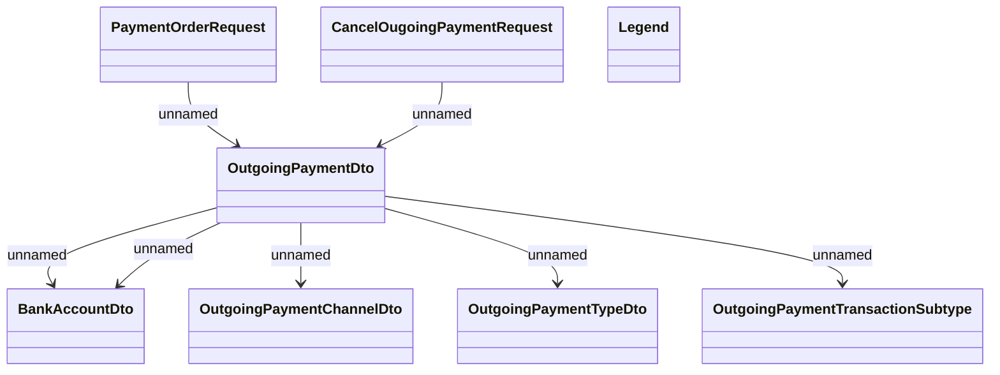

# Outgoing payments request

```mermaid
classDiagram
    class OutgoingPaymentTransactionSubtype["OutgoingPaymentTransactionSubtype"]
    class PaymentOrderRequest["PaymentOrderRequest"]
    class CancelOugoingPaymentRequest["CancelOugoingPaymentRequest"]
    class Legend["Legend"]
    class OutgoingPaymentTypeDto["OutgoingPaymentTypeDto"]
    class OutgoingPaymentChannelDto["OutgoingPaymentChannelDto"]
    class BankAccountDto["BankAccountDto"]
    class OutgoingPaymentDto["OutgoingPaymentDto"]
    PaymentOrderRequest --> OutgoingPaymentDto : unnamed
    CancelOugoingPaymentRequest --> OutgoingPaymentDto : unnamed
    OutgoingPaymentDto --> BankAccountDto : unnamed
    OutgoingPaymentDto --> BankAccountDto : unnamed
    OutgoingPaymentDto --> OutgoingPaymentChannelDto : unnamed
    OutgoingPaymentDto --> OutgoingPaymentTypeDto : unnamed
    OutgoingPaymentDto --> OutgoingPaymentTransactionSubtype : unnamed
```
