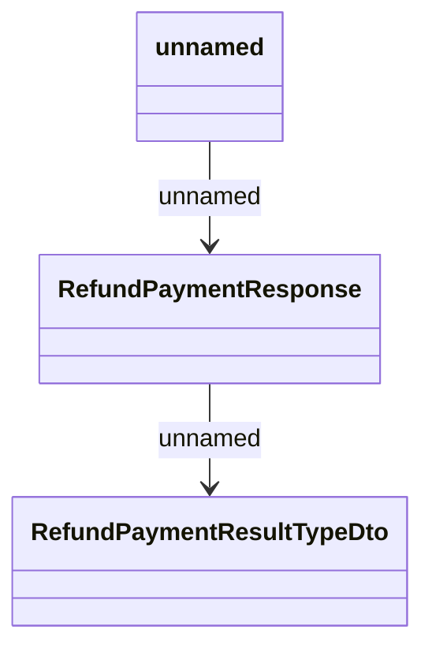

# Generated messages - Refunds

```mermaid
classDiagram
    class RefundPaymentResultTypeDto["RefundPaymentResultTypeDto"]
    class RefundPaymentResponse["RefundPaymentResponse"]
    unnamed --> RefundPaymentResponse : unnamed
    RefundPaymentResponse --> RefundPaymentResultTypeDto : unnamed
```
