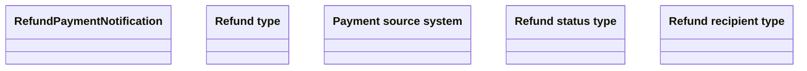

# Refund Payment Notification

- **Diagram Type**: Logical
- **Package**: HomerSelect/BSL/Analysis Model/_Interface/RabbitMQ messages/Generated RabbitMQ messages/Refunds
- **Diagram ID**: 164524
- **Elements**: 5
- **Connectors**: 0

