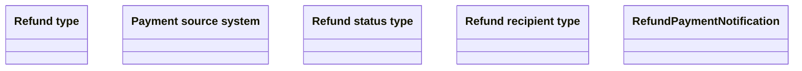

# Refund Payment Notification

```mermaid
classDiagram
    class Refund_type["Refund type"]
    class Payment_source_system["Payment source system"]
    class Refund_status_type["Refund status type"]
    class Refund_recipient_type["Refund recipient type"]
    class RefundPaymentNotification["RefundPaymentNotification"]
```
