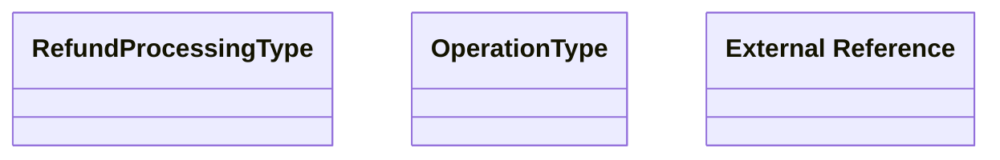

# Refund Payment Request

- **Diagram Type**: Logical
- **Package**: HomerSelect/BSL/Analysis Model/_Interface/RabbitMQ messages/Generated RabbitMQ messages/Refunds
- **Diagram ID**: 164525
- **Elements**: 3
- **Connectors**: 0

