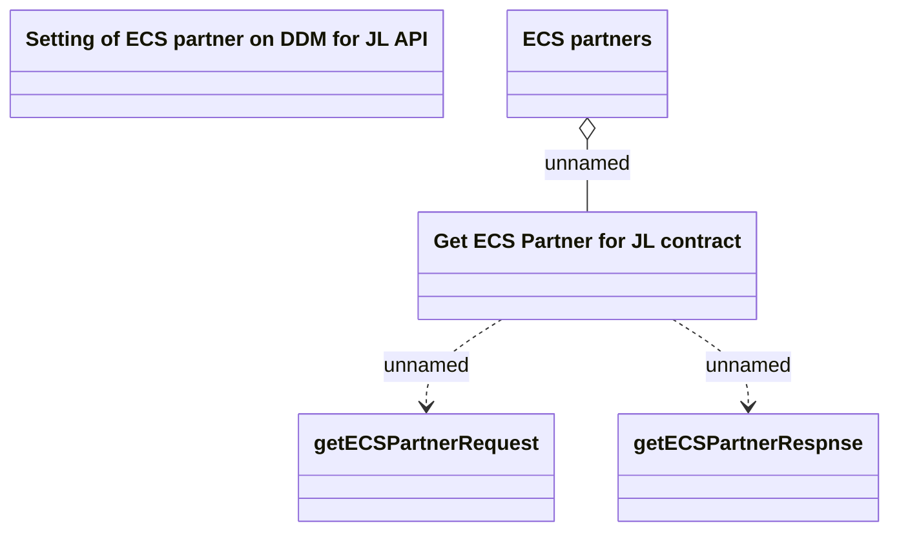

# Setting of ECS partner on DDM for JL API

- **Diagram Type**: Logical
- **Package**: HomerSelect/BSL/Analysis Model/_Interface/Setting of ECS partner on DDM for JL API/PAYM
- **Diagram ID**: 113126
- **Elements**: 5
- **Connectors**: 3

