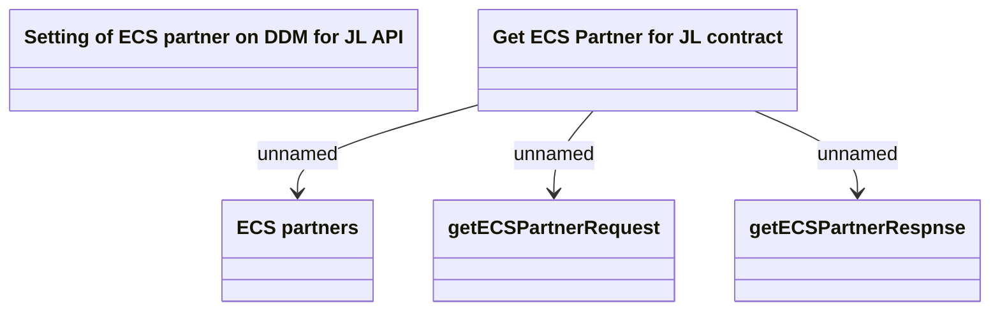

# Setting of ECS partner on DDM for JL API

```mermaid
classDiagram
    class Setting_of_ECS_partner_on_DDM_for_JL_API["Setting of ECS partner on DDM for JL API"]
    class getECSPartnerRespnse["getECSPartnerRespnse"]
    class getECSPartnerRequest["getECSPartnerRequest"]
    class Get_ECS_Partner_for_JL_contract["Get ECS Partner for JL contract"]
    class ECS_partners["ECS partners"]
    Get_ECS_Partner_for_JL_contract --> ECS_partners : unnamed
    Get_ECS_Partner_for_JL_contract --> getECSPartnerRequest : unnamed
    Get_ECS_Partner_for_JL_contract --> getECSPartnerRespnse : unnamed
```
