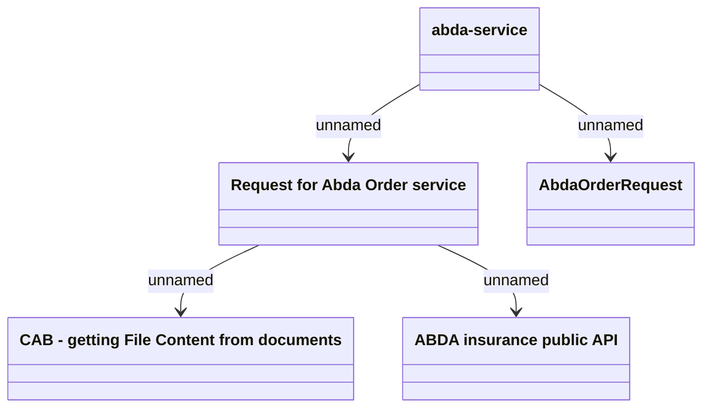

# REST

```mermaid
classDiagram
    class CAB_getting_File_Content_from_documents["CAB - getting File Content from documents"]
    class ABDA_insurance_public_API["ABDA insurance public API"]
    class Request_for_Abda_Order_service["Request for Abda Order service"]
    class abda_service["abda-service"]
    class AbdaOrderRequest["AbdaOrderRequest"]
    Request_for_Abda_Order_service --> CAB_getting_File_Content_from_documents : unnamed
    Request_for_Abda_Order_service --> ABDA_insurance_public_API : unnamed
    abda_service --> Request_for_Abda_Order_service : unnamed
    abda_service --> AbdaOrderRequest : unnamed
```
