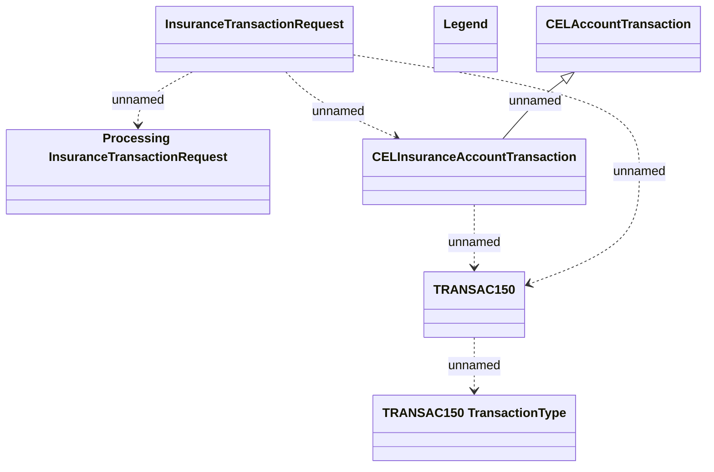

# Additional insurance transaction - Communication model

- **Diagram Type**: Logical
- **Package**: HomerSelect/BSL/Modules/CBS Adapter/Analysis model/Account Transactions/Communication model
- **Diagram ID**: 92041
- **Elements**: 7
- **Connectors**: 6

