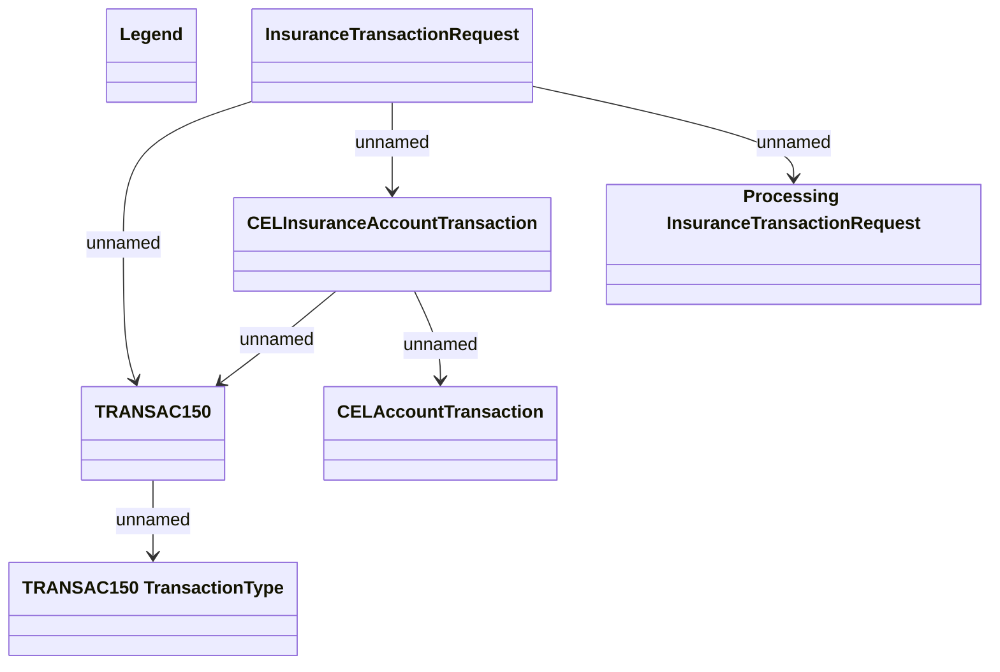

# Additional insurance transaction - Communication model

```mermaid
classDiagram
    class Processing_InsuranceTransactionRequest["Processing InsuranceTransactionRequest"]
    class TRANSAC150_TransactionType["TRANSAC150 TransactionType"]
    class TRANSAC150["TRANSAC150"]
    class CELAccountTransaction["CELAccountTransaction"]
    class CELInsuranceAccountTransaction["CELInsuranceAccountTransaction"]
    class Legend["Legend"]
    class InsuranceTransactionRequest["InsuranceTransactionRequest"]
    CELInsuranceAccountTransaction --> TRANSAC150 : unnamed
    InsuranceTransactionRequest --> TRANSAC150 : unnamed
    TRANSAC150 --> TRANSAC150_TransactionType : unnamed
    InsuranceTransactionRequest --> CELInsuranceAccountTransaction : unnamed
    InsuranceTransactionRequest --> Processing_InsuranceTransactionRequest : unnamed
    CELInsuranceAccountTransaction --> CELAccountTransaction : unnamed
```
