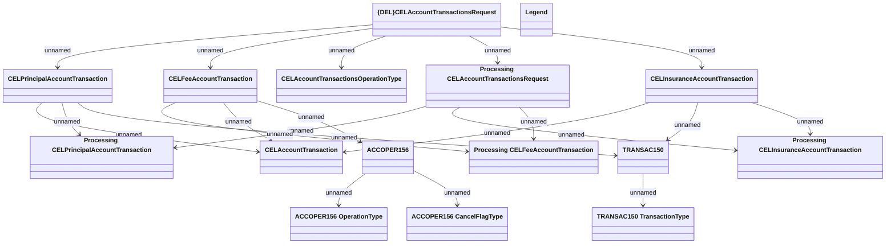

# CEL Account Transactions - Communication model

```mermaid
classDiagram
    class TRANSAC150["TRANSAC150"]
    class ACCOPER156["ACCOPER156"]
    class CELPrincipalAccountTransaction["CELPrincipalAccountTransaction"]
    class CELAccountTransactionsOperationType["CELAccountTransactionsOperationType"]
    class Processing_CELInsuranceAccountTransaction["Processing CELInsuranceAccountTransaction"]
    class CELInsuranceAccountTransaction["CELInsuranceAccountTransaction"]
    class Processing_CELFeeAccountTransaction["Processing CELFeeAccountTransaction"]
    class Processing_CELAccountTransactionsRequest["Processing CELAccountTransactionsRequest"]
    class Processing_CELPrincipalAccountTransaction["Processing CELPrincipalAccountTransaction"]
    class CELFeeAccountTransaction["CELFeeAccountTransaction"]
    class CELAccountTransaction["CELAccountTransaction"]
    class DEL_CELAccountTransactionsRequest["{DEL}CELAccountTransactionsRequest"]
    class Legend["Legend"]
    class ACCOPER156_CancelFlagType["ACCOPER156 CancelFlagType"]
    class ACCOPER156_OperationType["ACCOPER156 OperationType"]
    class TRANSAC150_TransactionType["TRANSAC150 TransactionType"]
    Processing_CELAccountTransactionsRequest --> Processing_CELPrincipalAccountTransaction : unnamed
    Processing_CELAccountTransactionsRequest --> Processing_CELInsuranceAccountTransaction : unnamed
    Processing_CELAccountTransactionsRequest --> Processing_CELFeeAccountTransaction : unnamed
    TRANSAC150 --> TRANSAC150_TransactionType : unnamed
    ACCOPER156 --> ACCOPER156_OperationType : unnamed
    ACCOPER156 --> ACCOPER156_CancelFlagType : unnamed
    DEL_CELAccountTransactionsRequest --> CELPrincipalAccountTransaction : unnamed
    DEL_CELAccountTransactionsRequest --> CELFeeAccountTransaction : unnamed
    DEL_CELAccountTransactionsRequest --> CELAccountTransactionsOperationType : unnamed
    DEL_CELAccountTransactionsRequest --> Processing_CELAccountTransactionsRequest : unnamed
    DEL_CELAccountTransactionsRequest --> CELInsuranceAccountTransaction : unnamed
    CELFeeAccountTransaction --> Processing_CELFeeAccountTransaction : unnamed
    CELFeeAccountTransaction --> CELAccountTransaction : unnamed
    CELFeeAccountTransaction --> ACCOPER156 : unnamed
    CELInsuranceAccountTransaction --> CELAccountTransaction : unnamed
    CELPrincipalAccountTransaction --> CELAccountTransaction : unnamed
    CELInsuranceAccountTransaction --> TRANSAC150 : unnamed
    CELInsuranceAccountTransaction --> Processing_CELInsuranceAccountTransaction : unnamed
    CELPrincipalAccountTransaction --> Processing_CELPrincipalAccountTransaction : unnamed
    CELPrincipalAccountTransaction --> TRANSAC150 : unnamed
```
