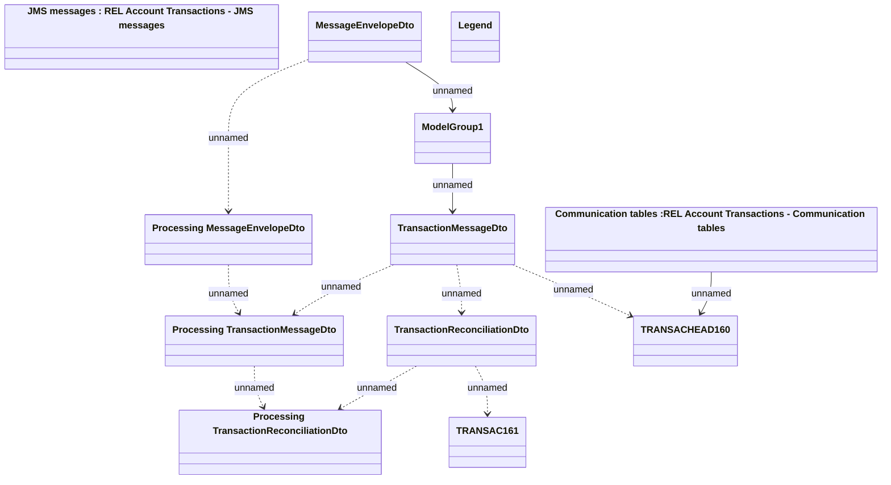

# REL Account Transactions - Communication model

- **Diagram Type**: Logical
- **Package**: HomerSelect/BSL/Modules/CBS Adapter/Analysis model/Account Transactions/Communication model
- **Diagram ID**: 92040
- **Elements**: 12
- **Connectors**: 11

