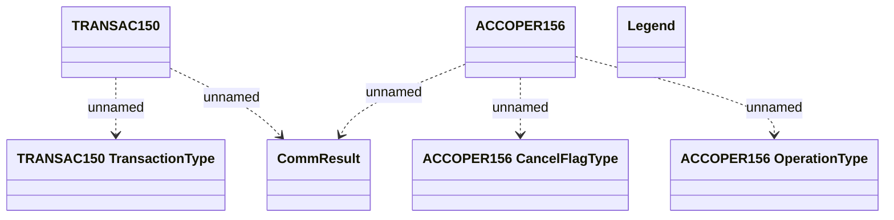

# CEL Account Transactions - Communication tables

- **Diagram Type**: Logical
- **Package**: HomerSelect/BSL/Modules/CBS Adapter/Analysis model/Account Transactions/Communication model/Communication tables
- **Diagram ID**: 97457
- **Elements**: 7
- **Connectors**: 5

