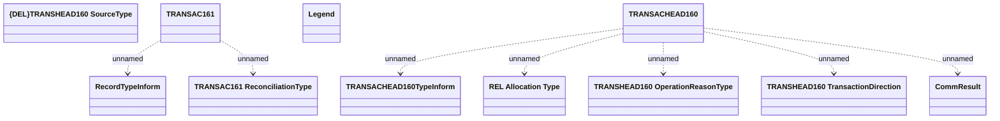

# REL Account Transactions - Communication tables

- **Diagram Type**: Logical
- **Package**: HomerSelect/BSL/Modules/CBS Adapter/Analysis model/Account Transactions/Communication model/Communication tables
- **Diagram ID**: 97458
- **Elements**: 11
- **Connectors**: 7

