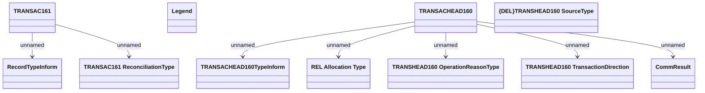

# REL Account Transactions - Communication tables

```mermaid
classDiagram
    class REL_Allocation_Type["REL Allocation Type"]
    class TRANSACHEAD160TypeInform["TRANSACHEAD160TypeInform"]
    class TRANSAC161_ReconciliationType["TRANSAC161 ReconciliationType"]
    class RecordTypeInform["RecordTypeInform"]
    class TRANSHEAD160_TransactionDirection["TRANSHEAD160 TransactionDirection"]
    class TRANSHEAD160_OperationReasonType["TRANSHEAD160 OperationReasonType"]
    class TRANSAC161["TRANSAC161"]
    class CommResult["CommResult"]
    class Legend["Legend"]
    class TRANSACHEAD160["TRANSACHEAD160"]
    class DEL_TRANSHEAD160_SourceType["{DEL}TRANSHEAD160 SourceType"]
    TRANSACHEAD160 --> TRANSACHEAD160TypeInform : unnamed
    TRANSACHEAD160 --> REL_Allocation_Type : unnamed
    TRANSACHEAD160 --> TRANSHEAD160_OperationReasonType : unnamed
    TRANSACHEAD160 --> TRANSHEAD160_TransactionDirection : unnamed
    TRANSACHEAD160 --> CommResult : unnamed
    TRANSAC161 --> RecordTypeInform : unnamed
    TRANSAC161 --> TRANSAC161_ReconciliationType : unnamed
```
