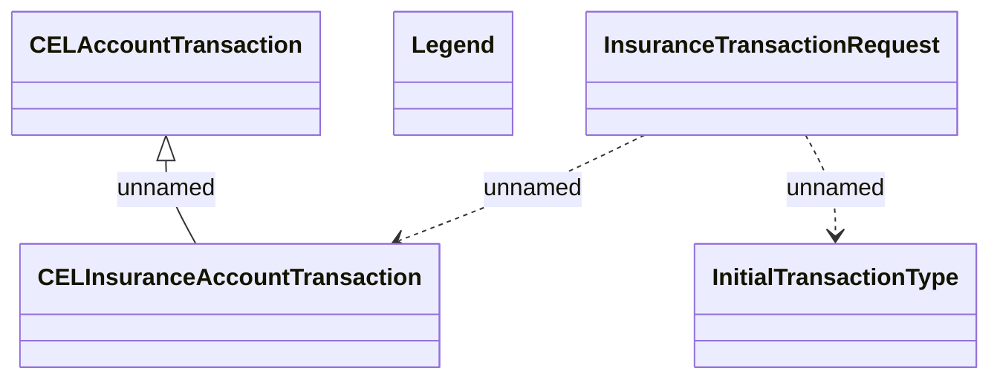

# Additional insurance transaction - JMS messages

- **Diagram Type**: Logical
- **Package**: HomerSelect/BSL/Modules/CBS Adapter/Analysis model/Account Transactions/Communication model/JMS messages
- **Diagram ID**: 102225
- **Elements**: 5
- **Connectors**: 3

